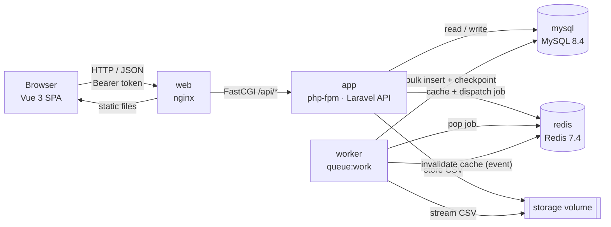
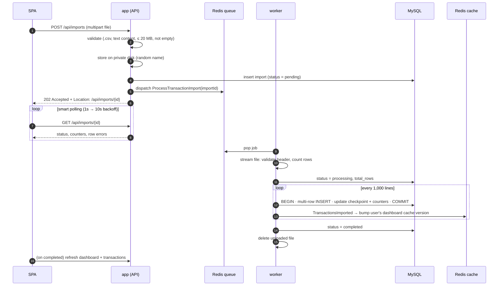

# Financial Import & Management System

[](https://github.com/KingISkin/teste-desenvolvedor-fullstack-sr/actions/workflows/ci.yml)

This is my solution to the **Senior Full Stack Developer practical test**: a system for importing and managing financial transactions.

- **Backend:** an isolated RESTful API built with **Laravel 12**.
- **Frontend:** a **Vue 3 + TypeScript** SPA.
- **Background work:** CSV files are processed in the background by **queues and jobs** on **Redis**, with data stored in **MySQL**.
- **Dashboard:** cached, and invalidated by **events**.
- **Infrastructure:** everything runs with **Docker Compose**, and every commit is checked by **GitHub Actions**.

---

## Table of contents

1. [Quick start (Docker)](#1-quick-start-docker)
2. [Running the tests](#2-running-the-tests)
3. [The challenge: requirement traceability](#3-the-challenge-requirement-traceability)
4. [Architecture](#4-architecture)
5. [How the CSV import works](#5-how-the-csv-import-works)
6. [Dashboard, cache and invalidation](#6-dashboard-cache-and-invalidation)
7. [API reference](#7-api-reference)
8. [Frontend](#8-frontend)
9. [Infrastructure (Docker)](#9-infrastructure-docker)
10. [Security](#10-security)
11. [Performance and scalability](#11-performance-and-scalability)
12. [Quality: tests, CI/CD and code style](#12-quality-tests-cicd-and-code-style)
13. [Technical decisions and trade-offs](#13-technical-decisions-and-trade-offs)
14. [Project structure](#14-project-structure)
15. [Configuration reference](#15-configuration-reference)
16. [Known limitations and production notes](#16-known-limitations-and-production-notes)

---

## 1. Quick start (Docker)

**Requirements:** Docker with Compose v2. Nothing else is needed on the host.

```bash
git clone https://github.com/KingISkin/teste-desenvolvedor-fullstack-sr.git
cd teste-desenvolvedor-fullstack-sr
docker compose up -d --build --wait
```

Then open **http://localhost:8080** and sign in with the demo account:

| E-mail             | Password   |
|--------------------|------------|
| `demo@example.com` | `password` |

To try the import, upload [`samples/financial_transactions.csv`](samples/financial_transactions.csv), which is the file provided by the test. It has 15,000 rows. The screen shows upload progress, then queue and processing progress. When the import finishes, the dashboard cards and the transaction list refresh on their own.

**What happens on the first boot:**
- The images are built.
- If `APP_KEY` is empty, one is generated and kept on the shared storage volume.
- Migrations run.
- The demo user is created (or re-synced). This step is idempotent.

**Optional configuration:** copy `.env.example` to `.env` to change ports, secrets or the demo credentials. Every variable has a safe local default, so this step is not required.

```bash
docker compose ps              # service status / health
docker compose logs -f worker  # watch the queue worker process imports
docker compose down            # stop (add -v to also remove the data volumes)
```

> Only the `web` service publishes a port, and only on `127.0.0.1`. MySQL and Redis are reachable only on the internal Compose network.

---

## 2. Running the tests

### Backend (Pest)

Using Docker (no PHP needed on the host). The official Composer image already includes PHP with `pdo_sqlite`. The whole repository is mounted because one feature test imports `samples/financial_transactions.csv` from the repository root:

```bash
docker run --rm -v "$(pwd):/app" -w /app/backend composer:2 sh -c "composer install --no-interaction --no-progress && vendor/bin/pest"
```

Locally (PHP ≥ 8.2 with `pdo_sqlite`, run from a full checkout so `samples/` is present):

```bash
cd backend
composer install
vendor/bin/pest            # or: php artisan test
vendor/bin/pint --test     # code style
```

By default the tests use an in-memory SQLite database, the `array` cache and a `sync` or faked queue, so they need no services. CI runs the same suite against **MySQL 8.4**, with **pcov** coverage and a minimum-coverage gate (`vendor/bin/pest --coverage --min=85`).

### Frontend (Vitest)

```bash
docker run --rm -v "$(pwd)/frontend:/app" -w /app node:22-alpine sh -c "npm ci && npm test && npm run build"
```

or locally (Node 20.19+ or 22.12+):

```bash
cd frontend
npm ci
npm test          # vitest run
npm run build     # vue-tsc type-check + vite build
```

### End-to-end (through the real Docker stack)

[`scripts/e2e-smoke.sh`](scripts/e2e-smoke.sh) drives the running stack through nginx, the same way the SPA does:

1. Checks that an anonymous request gets `401`, then logs in.
2. Uploads the sample CSV.
3. Polls the import until it completes.
4. Checks that the import counters, the income, expense and balance deltas, and the transaction count (`meta.total` of the listing) match the values it computes from the CSV with `awk`.
5. Logs out and checks that the revoked token gets `401`, then repeats the login/logout cycle.

It needs `curl`, `jq` and `awk`.

```bash
docker compose up -d --build --wait
bash scripts/e2e-smoke.sh
```

> On Windows, run the commands in Git Bash or WSL, or replace `$(pwd)` with `${PWD}` in PowerShell.

### What the tests cover

| Area | Backend (Pest) | Frontend (Vitest) |
|---|---|---|
| Auth | login (success, wrong credentials, validation, constant-time for unknown e-mails, rate limit), logout revokes only the current token, `/me`, every protected route returns `401` JSON, API rate limit, demo seeder | auth store, axios 401 interceptor, router guard |
| Upload | validation (missing, empty, wrong extension, spoofed content, size), `202` + `Location`, **job dispatched with the right import** (`Queue::fake`), upload throttle, cleanup when dispatch fails | client-side file checks, upload progress and status states |
| Import job | valid and invalid rows with line numbers, invalid header → failed, empty file, chunked checkpoint and **resume without duplicates**, redelivery ignored, overlapping deliveries dropped by the lock, **rollback of partial rows on final failure** (also inside an open transaction), event dispatched, full 15,000-row sample file with exact totals | polling with exponential backoff, stop on terminal status, cleanup on unmount |
| Dashboard | **income/expense/balance rules**, **expenses never counted as income**, per-user isolation, cached (no query on a hit), **invalidated after an import or rollback**, stale computations never served (versioned keys), single computation on a miss | summary formatting (BRL), store reset and stale response handling |
| Transactions | pagination, `per_page` bounds (max 100), ordering (date desc, id desc), per-user isolation, response fields | table pagination, loading, empty and error states |
| Domain units | CSV row parser (every rule), header rules (BOM, case), streaming reader line numbers, type mapping `Receita/Despesa → income/expense`, import status, summary value object | money and date formatters |

---

## 3. The challenge: requirement traceability

Every requirement in the test, and where it is implemented.

### Mandatory requirements

| Requirement | Implementation |
|---|---|
| **Isolated RESTful API, Laravel 9+** | Laravel 12, API-only: there are no web routes, sessions or Blade views, and every response (including errors) is JSON. See [`backend/routes/api.php`](backend/routes/api.php) and [`backend/bootstrap/app.php`](backend/bootstrap/app.php). |
| **API and frontend restricted to authenticated users** | Every route except `POST /api/auth/login` uses the `auth:sanctum` middleware (Bearer tokens that expire). The SPA has a route guard, and a 401 interceptor signs the user out. There is no public registration. |
| **CSV upload; reading, validation and persistence in background with Queues/Jobs** | `POST /api/imports` only validates the file, stores it and dispatches `ProcessTransactionImport` to Redis. The `worker` container streams, validates and bulk-inserts the rows. See [§5](#5-how-the-csv-import-works). |
| **Dashboard endpoint (income, expenses, balance), cached and invalidated automatically via Events/Observers** | `GET /api/dashboard` runs one aggregate query and caches the result per user in Redis. The `TransactionsImported` and `TransactionsRolledBack` events trigger the `InvalidateDashboardCache` listener. See [§6](#6-dashboard-cache-and-invalidation). |
| **Vue.js frontend: paginated transaction list and CSV upload with visual feedback** | Vue 3 + TS SPA with a paginated table and an upload component. The component shows upload %, queued, processing (x of y rows), completed, and failed with the row errors. |
| **Docker/docker-compose with at least App (PHP), DB (MySQL), Cache/Queue (Redis) and a Worker** | `app` (php-fpm), `mysql`, `redis`, `worker`, plus `web` (nginx serving the SPA and proxying `/api`). See [§9](#9-infrastructure-docker). |
| **Automated tests (Pest/PHPUnit) covering business rules and critical endpoints (e.g. queue dispatch, balance rules)** | Pest backend suite (unit and feature) plus Vitest frontend suite, run in CI with a coverage gate. See [§2](#2-running-the-tests). |
| **Transaction: date, description, amount, type (Receita/Despesa); expenses must never be summed as income** | `transactions` table (`transaction_date`, `description`, `amount` in integer cents, `type`). CSV `Receita`/`Despesa` map to the `TransactionType` enum `income`/`expense`, and the aggregate sums each type separately. Tests prove expenses never add to income. |
| **Use the provided CSV** | Committed as [`samples/financial_transactions.csv`](samples/financial_transactions.csv). It is imported end-to-end in a feature test and in the CI e2e job, with exact totals. |
| **README with instructions to run via Docker and run the tests** | This file. |

### Plus (architectural differentiators): all implemented

| Plus | Implementation |
|---|---|
| **DDD, Clean Code, SOLID, Design Patterns (Actions, Services, Repositories), no fat controllers** | Bounded contexts under `app/Domain` (Auth, Transactions, Imports, Dashboard) with Actions, DTOs/value objects, enums, events and contracts. Repositories, queue, storage, CSV reader and cache are implemented in `app/Infrastructure` and bound in `DomainServiceProvider`. Each controller method is a few lines: FormRequest → Action → Resource. |
| **API documentation (Swagger)** | Hand-written OpenAPI 3 specification: [`docs/openapi.yaml`](docs/openapi.yaml). |
| **CI/CD running the tests (GitHub Actions)** | [`.github/workflows/ci.yml`](.github/workflows/ci.yml) has four jobs: backend (Pint and Pest on MySQL with coverage), frontend (Vitest, type-check, build), the Docker-only test commands from this README, and e2e (the full Docker stack plus the smoke test). |
| **WebSockets, SSE or smart polling to notify the frontend when the CSV is processed** | Smart polling: `useImportPolling` uses exponential backoff (1s → 2s → 4s → 8s → 10s cap), stops on a terminal status, tolerates transient errors and cleans up when the component unmounts. |
| **All code and commits in English** | All identifiers, comments, UI text, docs and commit messages ([Conventional Commits](https://www.conventionalcommits.org/)) are in English. |

### Final observations from the test

| Observation | How it is addressed |
|---|---|
| Architecture, separation of responsibilities and **query optimization** will be evaluated critically | Layered design ([§4](#4-architecture)), covering indexes, a single aggregate query, chunked multi-row inserts, column projection and no N+1 (the dashboard's single query and its cache hit are asserted in tests). See [§11](#11-performance-and-scalability). |
| Avoid generators or scaffolding packages that hide business logic | Only the bare Laravel and Vite skeletons were used. There is no Breeze, Jetstream, Filament, CRUD generator or Swagger generator. All business logic is hand-written. |
| Clear, detailed README with Docker and test instructions | [§1](#1-quick-start-docker) and [§2](#2-running-the-tests). |
| Free technical decisions, as long as they are justified | [§13](#13-technical-decisions-and-trade-offs). |

---

## 4. Architecture



### Backend layers (DDD-lite, adapted to Laravel)

```
app/
├── Domain/                     # Business rules, grouped by bounded context
│   ├── Auth/                   # IssueAccessToken, RevokeCurrentAccessToken, UserRepository contract
│   ├── Transactions/           # TransactionType enum, TransactionData / TransactionTotals, events, repository contract
│   ├── Imports/                # Start / Import / Fail actions, CSV row parser, ImportStatus, queue/storage/reader contracts
│   └── Dashboard/              # GetDashboardSummary, DashboardSummary, cache contract, invalidation listener
├── Infrastructure/             # Implementations of the Domain contracts
│   ├── Persistence/            # Eloquent repositories
│   ├── Cache/                  # Versioned, stampede-protected summary cache
│   ├── Csv/                    # Streaming CSV reader (constant memory)
│   ├── Queue/                  # ImportProcessingQueue → dispatches the job
│   └── Storage/                # Private-disk file storage for uploads
├── Http/                       # Delivery layer: thin controllers, FormRequests, API Resources
├── Jobs/                       # Thin queue adapter (retry policy + overlap lock) → Domain action
├── Models/                     # Eloquent models (persistence mapping)
├── Policies/                   # Authorization (import ownership)
└── Providers/                  # Contract → implementation bindings, rate limiters, event wiring
```

**Dependency rule.** `Domain` depends on its own contracts, on a few framework *contracts* (config, events, hasher, DB connection and paginator) and, pragmatically, on the Eloquent models in `app/Models` (plus Sanctum's token model for logout). It never uses facades, HTTP classes, jobs or Infrastructure. Infrastructure implements the Domain contracts, and `DomainServiceProvider` binds them.

**Patterns used:**

| Pattern | Where |
|---|---|
| **Action** (single-purpose use case) | `StartTransactionImport`, `ImportTransactionsFromCsv`, `FailTransactionImport`, `GetDashboardSummary`, `IssueAccessToken`, … |
| **Repository** | `TransactionRepository`, `TransactionImportRepository`, `UserRepository` (Eloquent implementations) |
| **Adapter / Ports & Adapters** | `ImportProcessingQueue`, `ImportFileStorage`, `CsvReader`, `DashboardSummaryCache` |
| **DTO / Value Object** (readonly) | `TransactionData`, `TransactionTotals`, `DashboardSummary`, `UploadedCsv`, `RowError`, `LoginCredentials`, `IssuedToken` |
| **Observer (domain events)** | `TransactionsImported` / `TransactionsRolledBack` → `InvalidateDashboardCache` |
| **Strategy via backed enums** | `TransactionType::fromCsvLabel()`, `ImportStatus::isTerminal()` |
| **Policy** | `TransactionImportPolicy` (ownership; answers 404, not 403) |

A request flows like this: **Route → middleware (auth, throttle, policy) → FormRequest (validation) → Action (Domain) → Repository/Adapter (Infrastructure) → API Resource (JSON)**.

---

## 5. How the CSV import works



### CSV format

```csv
date,description,amount,type
2026-05-01,Mensalidade Cliente B #869,115346,Receita
2025-11-15,Impostos e Taxas #464,433209,Despesa
```

| Column | Rule |
|---|---|
| header | Must be exactly `date,description,amount,type`. Case, surrounding spaces and a UTF-8 BOM are tolerated. Anything else fails the whole import, with the error on line 1. |
| `date` | A real calendar date in `YYYY-MM-DD` (`2026-02-30` is rejected). |
| `description` | Required, valid UTF-8, at most 255 characters. |
| `amount` | A positive integer in **cents** (`115346` = R$ 1.153,46). Decimal, negative, zero or non-numeric values are rejected. At most 18 digits, so it fits a BIGINT. |
| `type` | `Receita` (→ `income`) or `Despesa` (→ `expense`), case-insensitive. |
| columns | Exactly 4 per row. Blank lines are skipped, and line numbers stay accurate. |

Invalid rows **do not stop the import**. They are skipped and reported with their **physical line number** and a clear message. The first 100 are stored and returned by the status endpoint. Valid rows are persisted.

### Reliability guarantees

- **Constant memory.** The file is streamed one line at a time (`fgets` + `str_getcsv`), never loaded whole, so a 20 MB file (~400k rows) uses the same memory as a small one.
- **Idempotent and resumable.** Each chunk (1,000 lines) is inserted **in the same DB transaction** that advances the import checkpoint (`last_processed_line` and counters). If a worker crashes, the retried job resumes right after the last committed chunk, so rows are never duplicated. This is tested, and it was also verified by killing the worker during a real import.
- **No concurrent processing of the same import.** `WithoutOverlapping` drops a duplicate delivery while another worker holds the lock. The lock expires with the job timeout (600s), before the queue's `retry_after` (660s), so a dead worker can never leave an import stuck.
- **Retries.** 3 tries with a 10s then 30s backoff, a 600s timeout, and `failOnTimeout`.
- **All-or-nothing on final failure.** If every attempt fails, `FailTransactionImport` rolls back any open transaction, **deletes the rows already inserted for that import**, marks it `failed` (resetting its counters) and, if any rows were removed, fires `TransactionsRolledBack`, which invalidates the cache. The user never sees partial data and can simply upload again without creating duplicates.
- **Dispatch failure.** If the queue is unreachable during upload, the stored file is deleted, the import is marked `failed` and the error propagates. No import is left in `pending` forever.
- **File lifecycle.** The upload is deleted after a successful import. A failed import keeps its file for troubleshooting.

### Import statuses

`pending` → `processing` → `completed` | `failed`

The response carries `total_rows`, `processed_rows` (imported), `failed_rows` (rejected), `errors[] {line, message}`, `created_at` and `finished_at`. Line `0` means a file-level error (e.g. the file is missing), and line `1` means a header error.

---

## 6. Dashboard, cache and invalidation

`GET /api/dashboard` returns `{ income, expense, balance }` in **cents**:

- `income` = sum of `amount` where `type = income`
- `expense` = sum of `amount` where `type = expense`
- `balance` = `income − expense`, derived in the `DashboardSummary` value object, never stored

Amounts are always stored as positive integers; the type decides the sign. The aggregate is a single query with conditional sums per type, answered from the covering index `(user_id, type, amount)`. **An expense can never be added to income**, and tests cover this rule explicitly.

**Cache design:**

| Aspect | Decision |
|---|---|
| Store | Redis (the default cache store in Docker) |
| Scope | Per user: `dashboard:summary:user:{id}:v{version}` |
| Invalidation | Domain events `TransactionsImported` (after each committed chunk) and `TransactionsRolledBack` → listener `InvalidateDashboardCache` → `DashboardSummaryCache::forget()` |
| Race safety | **Versioned keys.** Invalidation atomically `INCR`s the user's version instead of deleting the entry. A request that read the old data and writes afterwards writes to the old version's key, which is never read again, so a stale total can never be served. |
| Stampede protection | On a miss, a Redis lock lets only one request per user and version run the aggregate. Others wait briefly for its result. If the wait times out, they answer with fresh data and skip the cache write. |
| TTL | 1 hour, only as a safety net. Correctness comes from the events. |

*Why events rather than a model Observer?* Transactions are written with multi-row `INSERT`s for performance, and Eloquent model observers do not fire for bulk inserts. So the import action dispatches an explicit domain event once per committed chunk. This makes the invalidation explicit, testable and independent of how rows are persisted.

---

## 7. API reference

Full specification: **[`docs/openapi.yaml`](docs/openapi.yaml)** (OpenAPI 3.0). You can view it at [editor.swagger.io](https://editor.swagger.io) (*File → Import URL*) using the raw GitHub URL of the file.

Base URL: `http://localhost:8080/api`. All endpoints except login need `Authorization: Bearer <token>`. Every response is JSON.

| Method | Endpoint | Description | Success | Errors |
|---|---|---|---|---|
| `POST` | `/auth/login` | Issue an access token (`email`, `password`) | `200` `{token, token_type, expires_at, user}` | `422` invalid credentials or validation, `429` throttled |
| `POST` | `/auth/logout` | Revoke the current token | `204` | `401` |
| `GET` | `/auth/me` | Authenticated user | `200` `{data: {id, name, email}}` | `401` |
| `GET` | `/dashboard` | Income, expense and balance in cents (cached) | `200` `{data: {income, expense, balance}}` | `401` |
| `GET` | `/transactions?page=&per_page=` | Paginated transactions, newest first (`per_page` default 15, max 100) | `200` `{data: [...], links, meta}` | `401`, `422` |
| `POST` | `/imports` | Upload a CSV (multipart field `file`) and queue it | `202` `{data: Import}` + `Location` header | `401`, `422`, `429` |
| `GET` | `/imports/{id}` | Import status (polled by the SPA) | `200` `{data: Import}` | `401`, `404` (unknown **or** another user's) |

Example:

```bash
TOKEN=$(curl -s -X POST http://localhost:8080/api/auth/login \
  -H 'Content-Type: application/json' -H 'Accept: application/json' \
  -d '{"email":"demo@example.com","password":"password"}' | jq -r .token)

curl -s -X POST http://localhost:8080/api/imports \
  -H "Authorization: Bearer $TOKEN" -H 'Accept: application/json' \
  -F file=@samples/financial_transactions.csv
# → 202 {"data":{"id":1,"status":"pending",...}}

curl -s http://localhost:8080/api/imports/1 -H "Authorization: Bearer $TOKEN" -H 'Accept: application/json'
curl -s http://localhost:8080/api/dashboard -H "Authorization: Bearer $TOKEN" -H 'Accept: application/json'
curl -s "http://localhost:8080/api/transactions?page=1&per_page=15" -H "Authorization: Bearer $TOKEN" -H 'Accept: application/json'
```

---

## 8. Frontend

**Stack:** Vue 3 (Composition API, `<script setup>`), TypeScript, Vite, Pinia, Vue Router and axios. Tests use Vitest, @vue/test-utils and jsdom. No UI library is used; the styling is plain, responsive and accessible CSS.

**Screens:**
- **Login:** e-mail and password, with validation errors, a loading state and rate-limit feedback.
- **Home** (authenticated):
  - **Header:** the signed-in user's name and a sign-out button.
  - **Summary cards:** income, expense and balance, formatted as BRL. The balance is colored by its sign.
  - **CSV upload:**
    - Checks the file on the client (`.csv`, size limit).
    - Shows upload progress (%).
    - Then shows the import state: queued, processing (*x of y rows*, with counts), completed (*n imported, m rejected*) or failed (with the reason).
    - Rejected rows are listed with their line numbers.
    - Status messages are announced to screen readers through `aria-live`.
    - When an import finishes, the cards and the table refresh on their own.
  - **Transactions table:** paginated on the server (15 per page), with date (pt-BR), description, a type badge and a colored amount. It has previous and next buttons, page info, and loading, empty and error states.

**Structure:**

```
src/
├── api/           axios client (Bearer token, 401 handling) + typed services per resource
├── stores/        Pinia: auth, dashboard, transactions (stale responses ignored)
├── composables/   useImportPolling: exponential-backoff polling
├── components/    AppHeader, SummaryCards, UploadCsv, TransactionsTable
├── views/         LoginView, HomeView (lazy-loaded routes)
├── router/        route guard (redirect to /login, safe ?redirect=)
├── utils/         money, date, csvFile checks, tokenStorage
└── types/         API contract types
```

**Smart polling.** After the upload returns `202`, `useImportPolling` polls `GET /api/imports/{id}` at 1s, 2s, 4s, 8s, then every 10s:
- A small file shows up almost instantly, while a large one doesn't flood the API.
- Polling stops at `completed` or `failed`.
- It gives up after 5 consecutive errors.
- Responses from a previous polling run are ignored.
- Timers are cleared when the component unmounts.

**Session handling.**
- The token is kept in `sessionStorage` (see the trade-off in [§13](#13-technical-decisions-and-trade-offs)).
- A `401` from any request clears the session and every user-data store, then redirects to `/login`.
- Signing out revokes the token on the server.

---

## 9. Infrastructure (Docker)

| Service | Image | Role |
|---|---|---|
| `web` | `nginxinc/nginx-unprivileged:1.27-alpine` (multi-stage: `node:22-alpine` builds the SPA) | Serves the SPA (history fallback, long-cache hashed assets), proxies `/api/*` to php-fpm, sets security headers and enforces the upload size limit. It is the only published port (`127.0.0.1:8080`). |
| `app` | `php:8.3-fpm-alpine` (multi-stage: `composer:2` installs production dependencies) | Laravel API on php-fpm, with `pdo_mysql`, `redis` (phpredis) and `opcache`. Its entrypoint generates or shares the `APP_KEY`, waits for MySQL, caches config, routes and events, runs migrations and seeds the demo user. |
| `worker` | Same image as `app` | `php artisan queue:work redis --queue=default --sleep=1 --tries=3 --timeout=600 --max-jobs=500 --max-time=3600`. It restarts periodically to avoid memory leaks, has a graceful stop window and never runs migrations. |
| `mysql` | `mysql:8.4` | Relational storage (named volume). |
| `redis` | `redis:7.4-alpine` | Cache and queue, with password auth and AOF persistence. |

**Details:**
- **Healthchecks** on every service: php-fpm `/ping` (via `cgi-fcgi`, defined in the PHP image), `mysqladmin ping`, `redis-cli ping`, the `queue:work` process (`pgrep`) and nginx `/healthz` (defined in the web image). `depends_on: service_healthy` orders startup, so `docker compose up --wait` returns only when the whole stack is ready.
- **Shared `storage` volume** between `app` (writes uploads) and `worker` (reads them). The generated `APP_KEY` also lives there, so both containers share it.
- **Non-root:** php-fpm and the worker run as `www-data` on root-owned code, and nginx runs unprivileged.
- **One image for app and worker:** built once, it runs with a different command.
- **Production PHP settings:** `php.ini-production`, `expose_php=Off`, opcache enabled, and upload limits aligned with nginx and Laravel.
- **nginx resolves `app` at request time** through Docker DNS, so recreating the `app` container doesn't cause 502s.

---

## 10. Security

| Area | Measure |
|---|---|
| Authentication | Sanctum personal access tokens (stored hashed), **8-hour expiration**, logout revokes only the current token. The API is stateless (no cookies or sessions, so no CSRF surface). |
| Login hardening | Throttled to **5 attempts per minute per e-mail + IP**. The error is the same whether the e-mail or the password is wrong, and a **password hash check always runs, even for unknown e-mails**, so response timing doesn't reveal which accounts exist. |
| Authorization | Every query is scoped to the authenticated user. Import access goes through `TransactionImportPolicy`, and another user's import returns **404, the same as a missing id**, so ids can't be enumerated. Dashboard cache keys are per user. |
| Rate limiting | API: 120 requests/min per user. Uploads: 10/min per user. |
| Upload validation | Required, non-empty, **`.csv` extension and sniffed text content** (both checked; a renamed binary is rejected), ≤ 20 MB, with the limit enforced consistently in nginx, PHP and Laravel. Files are stored under a **random name** on a **private disk** that is never served; the original name is only kept as data. |
| Input handling | Row values are validated strictly (UTF-8, lengths, digit-only amounts, real dates). Row error messages are fixed text and never echo the input. Nothing reaches `fill()` from request input: data goes through DTOs and explicit attribute mapping. Queries use the query builder with bound parameters. |
| Mass assignment and serialization | Queued jobs carry only the import id, never models or file contents. |
| Error handling | `APP_DEBUG=false` in Docker. API errors are JSON with generic messages (no stack traces). Job failures store a generic message for the client. |
| CORS | Explicit `config/cors.php` with **no allowed origins** by default. The SPA is same-origin behind nginx, so CORS isn't needed; `CORS_ALLOWED_ORIGINS` enables it deliberately. |
| HTTP headers (nginx) | Strict `Content-Security-Policy` (no inline scripts or styles, `frame-ancestors 'none'`), `X-Content-Type-Options: nosniff`, `X-Frame-Options: DENY`, `Referrer-Policy: no-referrer`, `Permissions-Policy`, `Cross-Origin-Opener-Policy`, and `server_tokens off`. Only `/api/*` reaches PHP, always through a fixed `index.php`; the web root holds only the built SPA, so no PHP source or dotfiles can be served. |
| Frontend | No `v-html`, so all data is rendered as text. The login `?redirect=` only accepts in-app paths (no open redirect). The session is cleared on any `401`. |
| Containers | Non-root processes. MySQL and Redis are not published to the host, and Redis requires a password. The web port binds to loopback only. `.dockerignore` keeps `.env` files, tests and VCS data out of images. |
| Supply chain and CI | `composer audit` and `npm audit` are clean. CI runs with `permissions: contents: read`, uses no secrets, and pins third-party actions to **commit SHAs**. |
| Secrets | No real secret is committed. `.env.example` files only hold local defaults, and `APP_KEY` is generated at first boot when not provided. |

---

## 11. Performance and scalability

| Concern | Solution |
|---|---|
| Large files | Streaming reader (constant memory). Chunked **multi-row INSERT** (1,000 rows per statement and transaction) instead of one query per row. The 15,000-row sample imports in a few seconds. |
| Progress reporting | A cheap first pass counts rows, so the UI can show *x of y*. Counters are updated per chunk in the same transaction as the data. |
| Dashboard | One aggregate query with conditional sums, answered from the **covering index `(user_id, type, amount)`**. The result is cached in Redis per user, and the stampede lock keeps concurrent misses from hitting MySQL. |
| Listing | `WHERE user_id = ? ORDER BY transaction_date DESC, id DESC LIMIT/OFFSET`, served by the composite index **`(user_id, transaction_date, id)`**. Only the needed columns are selected and there is no N+1 (the resource reads plain columns, no relations). `per_page` is capped at 100. |
| Async throughput | Uploads return `202` immediately. Work runs on Redis-backed workers, so you can scale out with `docker compose up -d --scale worker=N`: each import is protected by its own lock, and idempotent checkpoints make redelivery safe. |
| Frontend | Lazy-loaded routes with a small main bundle, exponential-backoff polling, and out-of-order responses ignored. |

---

## 12. Quality: tests, CI/CD and code style

- **Backend:** Pest (unit and feature). Tests run in isolation, each with its own upload directory, so the suite is stable under parallel or repeated runs. The full sample file is imported through the real endpoint and job, with exact totals.
- **Frontend:** Vitest (stores, API client, composable with fake timers, components, router, views), plus `vue-tsc` strict type-checking in the build.
- **Code style:** Laravel Pint (`backend/pint.json`) and `declare(strict_types=1)` everywhere. Classes are `final` (except the Eloquent models), DTOs are `readonly`, and constructor injection is used throughout.
- **CI:** [GitHub Actions](.github/workflows/ci.yml) runs on every push to `main` and on every pull request:
  1. **Backend:** PHP 8.3, Composer cache, `pint --test`, then `pest --coverage --min=85` (pcov) against a **MySQL 8.4 service**, the same engine as production.
  2. **Frontend:** Node 22, `npm ci`, `vitest run`, then `vue-tsc` + `vite build`.
  3. **README test commands:** runs the Docker-only backend (`composer:2`) and frontend (`node:22-alpine`) commands from [§2](#2-running-the-tests), so they keep working.
  4. **E2E** (after backend and frontend pass): builds and boots the real Compose stack (`docker compose up --build --wait`), then runs `scripts/e2e-smoke.sh` through nginx. It checks that anonymous requests get `401`, login, upload of the 15,000-row sample, polling to completion, exact import counters, income, expense and balance values and transaction count computed with awk from the CSV, logout and token revocation. On failure it prints the service logs.
- **Git history:** small, atomic [Conventional Commits](https://www.conventionalcommits.org/) in English (`feat(imports): …`, `fix(dashboard): …`, `test(backend): …`, `chore(docker): …`).

---

## 13. Technical decisions and trade-offs

| Decision | Why | Trade-off / alternative |
|---|---|---|
| **Laravel 12 + PHP 8.3** | A current, supported release line; the test asks for 9+. `composer.json` allows `^8.2`. | Laravel 13 is available; upgrading was not needed for anything the test asks for. |
| **Sanctum Bearer tokens (stateless)** | The test asks for an *isolated* REST API. Tokens work for any client (SPA, mobile, scripts), avoid CSRF, and can expire and be revoked individually. | Sanctum's SPA cookie mode (httpOnly) would protect the token from XSS, but it couples the API to a session and domain. XSS risk is reduced instead by a strict CSP and no `v-html`. |
| **Token in `sessionStorage`** | Cleared when the tab closes, which limits exposure. It survives reloads, and the API stays stateless. | `localStorage` persists longer (more exposure); memory-only would log the user out on every reload. |
| **No registration endpoint** | The test only requires access to be restricted to authenticated users. A demo user is seeded from environment variables. | Registration was left out on purpose, following the rule to build nothing beyond the test. |
| **`/auth/me` and `/auth/logout`** | `me` restores the session after a reload and shows the user's name; `logout` revokes the token. Both are needed for a correct auth flow. | – |
| **Money as unsigned BIGINT cents** | The CSV amounts are integer cents. Integers avoid floating-point rounding, and BIGINT handles very large totals. | Formatting to BRL happens only in the UI. |
| **Type stored as `income`/`expense`, mapped from `Receita`/`Despesa`** | A language-neutral domain enum (all code in English); the mapping lives in one place (`TransactionType::fromCsvLabel`). | – |
| **Invalid rows skipped and reported, valid rows imported** | Typical import behavior: one bad line shouldn't discard 14,999 good ones, and the user sees exactly which lines failed and why. | A header error fails the whole file, because it means the file isn't in the expected format. |
| **All-or-nothing on *technical* failure** | If the job ultimately fails (crash, timeout), partial rows are rolled back, so a new upload can't duplicate data. | Earlier chunks are visible on the dashboard while an import is still running. That is intended, and it is what makes the progress real. |
| **Two passes over the file** | The first, cheap pass validates the header and counts rows, so the UI can show *x of y* from the start. | About twice the sequential I/O over a local file, which is negligible next to the database writes. |
| **Physical line numbers** | Error messages point to the exact line in the user's file. | Quoted fields containing line breaks are not supported. The format doesn't need them, and such rows are reported as invalid. |
| **Events + listener for cache invalidation (not model observers)** | Bulk inserts don't fire Eloquent model events, and an explicit domain event is clearer and testable. | – |
| **Versioned cache keys and a lock** | Fixes the classic race where a slow read writes stale totals after an invalidation, and avoids stampedes on a miss. | Old versions expire by TTL instead of being deleted, which leaves a little dead data in Redis for up to 1 hour. |
| **Smart polling instead of WebSockets or SSE** | The test lists polling as an option. It needs no extra service (Reverb or Pusher), works through any proxy, and backoff keeps the load low. | Updates arrive with up to 10s of delay on very long imports. |
| **nginx serving the SPA and proxying the API (same origin)** | No CORS, one public port, a single place for security headers, and static assets served by nginx instead of PHP. | – |
| **phpredis (C extension) instead of predis** | Faster, compiled into the image. Tests use the `array` cache and `sync` queue, so they don't need it. | – |
| **Hand-written OpenAPI** | The test forbids generators that hide logic, and a hand-written spec documents the real contract (including 404-for-others and rollback semantics). | It has to be kept in sync by hand. |
| **Tests on SQLite locally, MySQL in CI** | Fast local feedback with no services needed; CI still checks the production engine. | – |

---

## 14. Project structure

```
.
├── backend/                  Laravel 12 API
│   ├── app/                  Domain / Infrastructure / Http / Jobs / Models / Policies / Providers (see §4)
│   ├── config/               imports.php, dashboard.php, demo.php, sanctum.php, cors.php, …
│   ├── database/             migrations (users, tokens, failed_jobs, transaction_imports, transactions), seeders
│   ├── routes/api.php        all routes (API only)
│   └── tests/                Pest: Unit/, Feature/ (Auth, Dashboard, Imports, Transactions) and NonTransactional/ (rollback on failure)
├── frontend/                 Vue 3 + TS SPA (see §8), tests/unit (Vitest)
├── docker/
│   ├── php/                  Dockerfile, entrypoint.sh, php.ini and php-fpm pool config
│   └── nginx/                Dockerfile (builds the SPA), default.conf
├── docs/openapi.yaml         API documentation (OpenAPI 3)
├── samples/                  financial_transactions.csv (the file provided by the test)
├── scripts/e2e-smoke.sh      end-to-end smoke test through the Docker stack
├── .github/workflows/ci.yml  CI: backend, frontend, Docker test commands, e2e
├── docker-compose.yml        web, app, worker, mysql, redis
└── .env.example              optional Compose overrides
```

---

## 15. Configuration reference

Root `.env` (read by Compose; every value is optional):

| Variable | Default | Description |
|---|---|---|
| `WEB_PORT` | `8080` | Host port of the web service (bound to `127.0.0.1`) |
| `APP_KEY` | *(generated)* | Laravel encryption key; generated on first boot when empty |
| `LOG_LEVEL` | `info` | Log level (logs go to stderr → `docker compose logs`) |
| `DB_DATABASE` / `DB_USERNAME` / `DB_PASSWORD` / `DB_ROOT_PASSWORD` | `finance` / `finance` / `finance-secret` / `root-secret` | MySQL credentials |
| `REDIS_PASSWORD` | `redis-secret` | Redis password |
| `SANCTUM_TOKEN_EXPIRATION` | `480` | Token lifetime (minutes) |
| `DEMO_USER_NAME` / `DEMO_USER_EMAIL` / `DEMO_USER_PASSWORD` | `Demo User` / `demo@example.com` / `password` | The seeded account |

Backend settings (environment variables, defaults in `backend/config`):

| Variable | Default | Description |
|---|---|---|
| `IMPORTS_MAX_UPLOAD_KB` | `20480` | Upload limit (keep nginx and php.ini aligned) |
| `IMPORTS_CHUNK_SIZE` | `1000` | Rows per INSERT and transaction |
| `IMPORTS_MAX_STORED_ERRORS` | `100` | Row errors kept per import |
| `DASHBOARD_CACHE_TTL` | `3600` | Safety-net TTL of the cached summary (seconds) |
| `REDIS_QUEUE_RETRY_AFTER` | `660` | Must stay above the job timeout (600s) |
| `CORS_ALLOWED_ORIGINS` | *(empty)* | Comma-separated origins, only if the SPA is served from another origin |

---

## 16. Known limitations and production notes

These are deliberately out of scope, since the test asks for nothing beyond its requirements, but they would be next steps for a real deployment:

- **TLS.** Terminate HTTPS at a load balancer or reverse proxy in front of `web`, and add `Strict-Transport-Security`.
- **Housekeeping.** Schedule `sanctum:prune-expired` and the cleanup of files kept from failed imports (a scheduler container running `schedule:work`).
- **Secrets.** Replace every default in `.env` (DB, Redis and demo passwords) and provide a fixed `APP_KEY` through a secret manager.
- **Observability.** Queue monitoring (e.g. Horizon) and centralized logs and metrics.
- **Real-time push.** If sub-second notifications were required, Laravel Reverb (WebSockets) could replace polling behind the same `onSettled` hook in the frontend.
